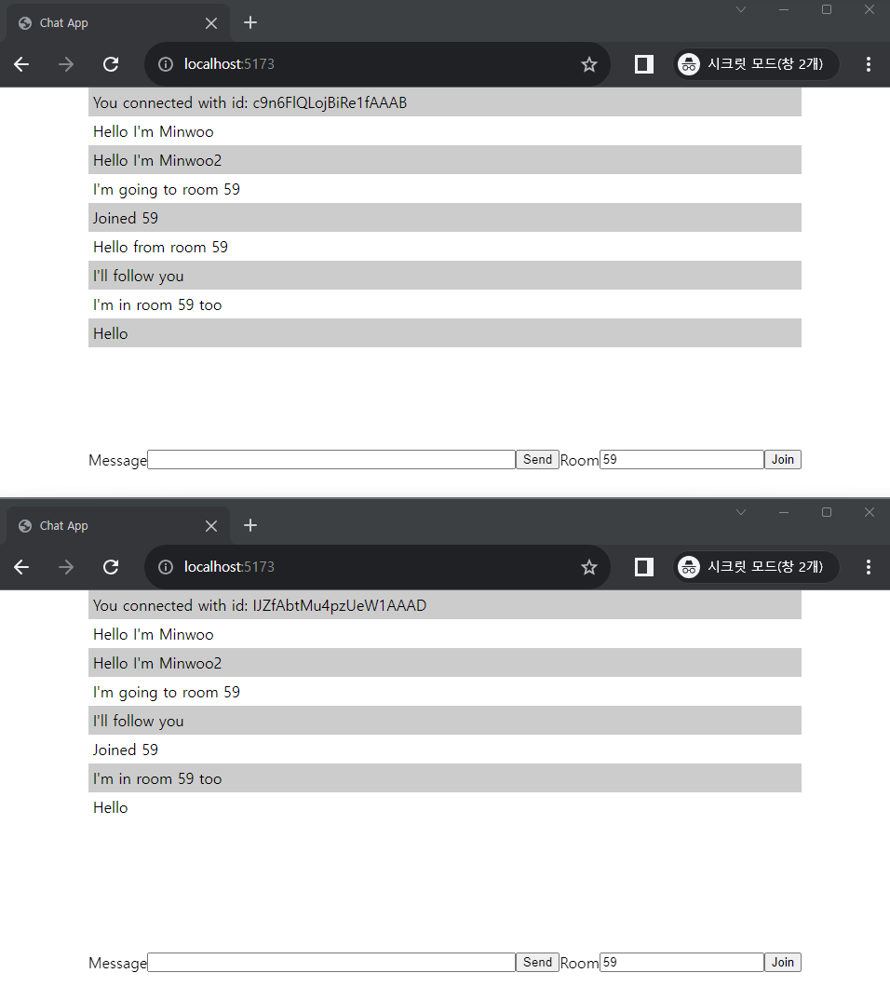

# SocketIO_Chat
## ChatApp using Socket.io



## Key Features
1. Sending & Receiving Events
2. Custom Events
    1. Client to Server
    2. Server to Client
3. Room (Sending a private event to socket)
    1. Join Room
    2. Leave Room
4. Calling Function in Client from Server-side
5. Disconnect / Reconnect

## Run
1. Install with `npm install`
2. Within `SocketIO_Chat` directory:
```bash
npm run dev
```
3. Within `server` directory:
```bash
npm run socketServer
```

## Reference
[Minwoo's Notion - Socket.IO](https://www.notion.so/Socket-io-2edc1eeebadc42df80b4903fd51314e8?pvs=4)

[Socket.io Crash Course](https://www.youtube.com/watch?v=ZKEqqIO7n-k)
